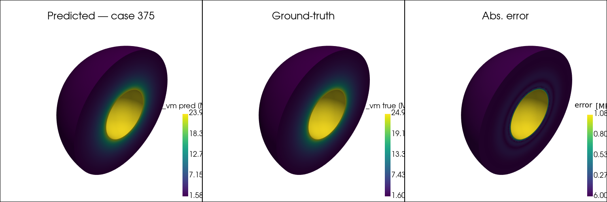

# neural-operators-heat2d

Comparing two neural operator architectures — **Fourier Neural Operator (FNO)** and **DeepONet** — on the task of learning the solution operator of the transient 2D heat equation. Given a set of physical parameters (boundary temperatures, initial temperature, diffusivity α, and time t), each model directly predicts the full 32×32 temperature field without solving the PDE at inference time. A Fourier-series analytical solver provides an exact baseline. The repository is a self-contained research case study: data generation, training, evaluation, and visualisation are all reproducible from a fresh clone.

---



*Above: DeepONet predicting the von Mises stress field in a thick-walled hollow sphere (Lamé problem). See [RESULTS.md](RESULTS.md) for the heat2d carousel and training curves.*

---

## Results

| Model | Architecture | Params | Val MSE (ep 200) | Test Rel L2 |
|---|---|---|---|---|
| FNO | modes=(12,12), ch=32, 4 layers | ~700 K | 8.3 × 10⁻⁴ | ~4% |
| DeepONet2D | branch+trunk MLP, w=256, p=128, d=3 | ~330 K | 4.0 × 10⁻³ | ~5% |
| Analytical | Fourier series (exact baseline) | — | — | — |

Full figures and rendered outputs: [RESULTS.md](RESULTS.md)

---

## Reproduce from scratch

**Requirements:** Python 3.10+, ~4 GB RAM for the full dataset, GPU optional.

```bash
git clone <repo-url>
cd neural-operators-heat2d

python -m venv .venv && source .venv/bin/activate

# CPU install (swap cu121 for GPU):
pip install torch==2.5.1+cpu --index-url https://download.pytorch.org/whl/cpu
pip install -e .
```

### 5-minute demo (50 cases)

```bash
python scripts/generate_heat2d_dataset.py --config configs/heat2d_smoke.yaml
jupyter notebook notebooks/heat2d_train_compare.ipynb
```

### Full run (5 000 cases, 200 epochs)

```bash
python scripts/generate_heat2d_dataset.py          # ~15 min on 8 CPU cores
jupyter notebook notebooks/heat2d_train_compare.ipynb
python scripts/generate_carousel.py                # outputs/heat2d_carousel.pdf
python scripts/generate_animation.py               # outputs/heat2d_animation.mp4
```

The Lamé sphere problem requires a VTK mesh (`data/sphere-FEMMeshGmsh.vtk`) and `pyvista`; the heat2d pipeline has no such dependency.

---

## Run tests and lint

```bash
pip install -e ".[dev]"
pytest tests/ -v
ruff check src/ tests/ scripts/
```

CI runs on every push via GitHub Actions (ruff + pytest + 50-case smoke dataset generation).

---

## Project structure

```
src/neural_operators/
├── models/deeponet.py        # mlp(), DeepONet, DeepONet2D, DeepONet3D
├── data/heat2d.py            # Fourier solver, solve_case(), analytical_field()
├── data/anti_derivative.py   # loader for the NGC anti-derivative dataset
└── utils/metrics.py          # mse(), relative_l2(), metrics_summary()
configs/
├── heat2d.yaml               # full run (5 000 cases, 200 epochs)
└── heat2d_smoke.yaml         # quick demo (50 cases)
notebooks/
├── heat2d_train_compare.ipynb   # main FNO vs DeepONet comparison
├── lame_sphere_train.ipynb      # DeepONet on 3D elasticity
└── fno_anti_derivative.ipynb    # FNO on 1D anti-derivative
scripts/
├── generate_heat2d_dataset.py   # dataset generation (parallel, Parquet output)
├── generate_carousel.py         # outputs/heat2d_carousel.pdf
├── generate_animation.py        # outputs/heat2d_animation.mp4
└── render_lame_sphere_3d.py     # outputs/lame_sphere_3d_*.png
tests/
├── test_heat2d.py               # solve_case, analytical_field smoke tests
└── test_models.py               # DeepONet, DeepONet2D, FNO forward-pass tests
```

---

## What I learned

FNO reaches roughly 1.5× lower test error than DeepONet on this problem because spectral convolution directly parameterises the Fourier modes the heat equation lives in — it is, in a sense, the right inductive bias for this PDE. DeepONet's branch-trunk decomposition is a more general and arguably cleaner fit when the operator is parameterised by a small set of scalars: the branch encodes "which physics" and the trunk encodes "where to evaluate," keeping the two concerns orthogonal. FNO is grid-tied to the 32×32 training discretisation, while DeepONet is inherently mesh-free — a concrete advantage when query locations are irregular or resolution needs to change at inference time without retraining. Both architectures plateaued around epoch 100–150; further Adam training showed diminishing returns, suggesting that a cosine warmup or LBFGS fine-tuning phase would help close the remaining gap. Normalising diffusivity α on a log scale and centering the boundary temperatures mattered more than any architecture choice: without it the DeepONet branch learned a degenerate representation that was nearly insensitive to α variation. Finally, the Fourier-series analytical solver is exact and evaluates any single new case at near-zero cost (the precomputed sine/sinh bases at import time amortise across the whole grid), so neural operators are only worthwhile here when thousands of new-parameter evaluations are needed without re-running the solver.

---

## Dependencies

- [PyTorch](https://pytorch.org/) 2.5
- [neuraloperator](https://neuraloperator.github.io/) >= 2.0 (FNO)
- NumPy, SciPy, matplotlib, tqdm
- PyArrow + pandas (Parquet dataset)
- PyVista (Lamé sphere visualisation only)
- ruff, pytest (dev)

---

## License

MIT — see [LICENSE](LICENSE).
