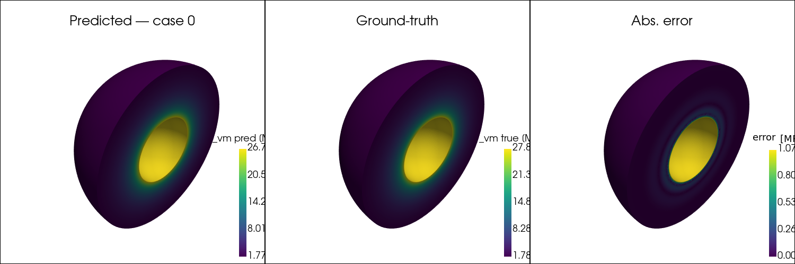
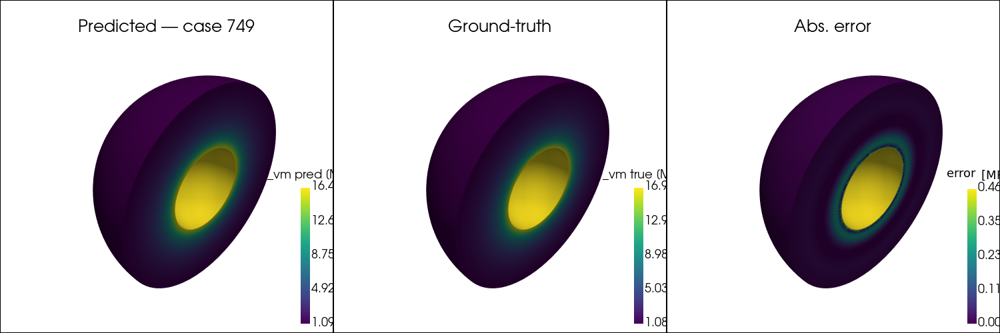

# Results

All results are from `notebooks/heat2d_train_compare.ipynb` trained on 5 000 cases (3 500 train / 750 val / 750 test), 200 epochs, Adam + exponential LR decay, on a single GPU.

## Performance summary

| Model | Architecture | Params | Val MSE (ep 200) | Test Rel L2 |
|---|---|---|---|---|
| FNO | modes=(12,12), ch=32, 4 layers | ~700 K | 8.3 × 10⁻⁴ | ~4% |
| DeepONet2D | branch+trunk MLP, w=256, p=128, d=3 | ~330 K | 4.0 × 10⁻³ | ~5% |
| Analytical | Fourier series, 40 steady + 20×20 transient modes | — | exact | — |

Relative L2 error is computed per sample as `‖u_pred − u_true‖₂ / ‖u_true‖₂`, averaged over the test set.

To reproduce these numbers exactly, run all cells in `notebooks/heat2d_train_compare.ipynb` after generating the full dataset (`n_cases: 5000`).

---

## Figures

### FNO vs DeepONet vs Analytical — carousel

Generate with:
```bash
python scripts/generate_carousel.py   # → outputs/heat2d_carousel.pdf
```

The PDF shows a 3×4 grid of test cases: ground-truth analytical field, FNO prediction, and DeepONet prediction side-by-side, with absolute error maps below each.

### Animated heat diffusion

```bash
python scripts/generate_animation.py  # → outputs/heat2d_animation.mp4
```

The animation steps through 10 log-spaced time snapshots (0.05 s → 30 s) for a representative test case, comparing FNO, DeepONet, and the analytical solution in real time.

To extract a single frame as a PNG for embedding:
```bash
ffmpeg -i outputs/heat2d_animation.mp4 -vframes 1 -q:v 2 outputs/heat2d_frame.png
```

### Lamé sphere — 3D stress field renders

Trained on the Lamé thick-walled hollow sphere problem (`notebooks/lame_sphere_train.ipynb`).

| Case 000 | Case 375 | Case 749 |
|---|---|---|
|  |  |  |

Cross-section views (von Mises equivalent stress). Outer-surface renders are in `outputs/lame_sphere_3d_case*_outer.png`.

Generate with:
```bash
python scripts/render_lame_sphere_3d.py   # → outputs/lame_sphere_3d_*.png
```
