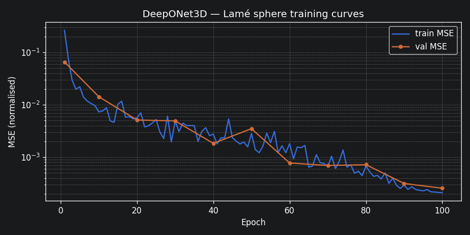
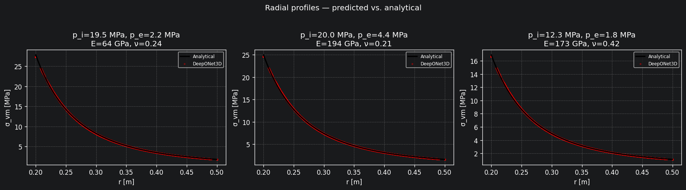
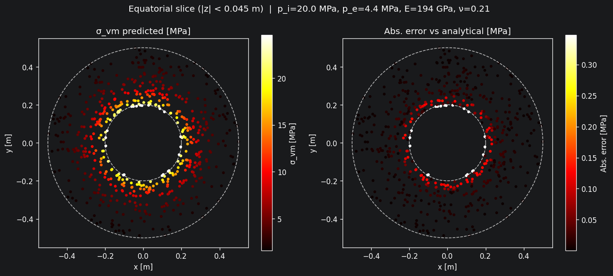
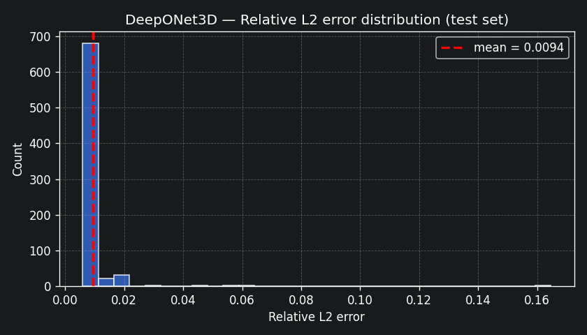
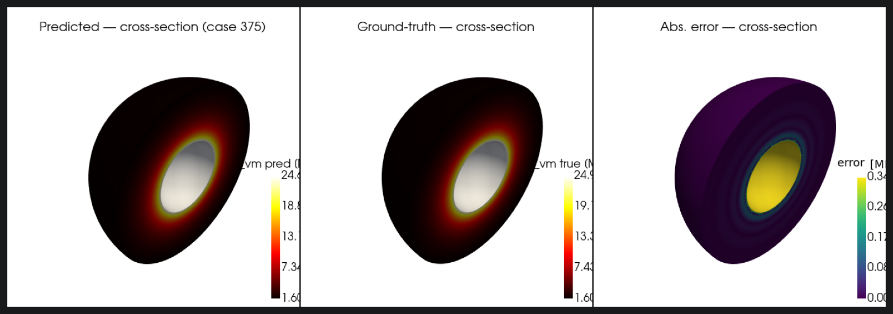
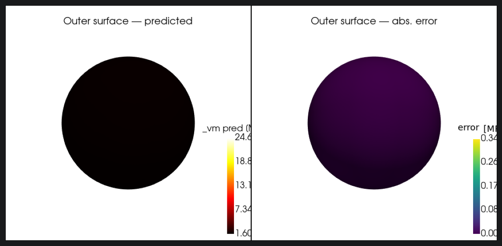

# Results

---

## Case 1: 2D Heat Equation

Trained in `notebooks/heat2d_train_compare.ipynb` on 5 000 cases (3 500 train / 750 val / 750 test), 200 epochs, Adam + exponential LR decay, single GPU.

| Model | Architecture | Params | Val MSE (ep 200) | Test Rel L2 |
|---|---|---|---|---|
| FNO | modes=(12,12), ch=32, 4 layers | ~700 K | 8.3 × 10⁻⁴ | ~4% |
| DeepONet2D | branch+trunk MLP, w=256, p=128, d=3 | ~330 K | 4.0 × 10⁻³ | ~5% |
| Analytical | Fourier series, 40 steady + 20×20 transient modes | — | exact | — |

Relative L2 is computed per sample as `‖u_pred − u_true‖₂ / ‖u_true‖₂`, averaged over the test set.

---

## Case 2: Lamé Hollow Sphere

Trained in `notebooks/lame_sphere_train.ipynb` on 5 000 cases (3 500 train / 750 val / 750 test), 100 epochs, Adam + cosine-annealing LR, single GPU, ~39 s training time.

### EDA-driven improvements

Before training, `notebooks/eda_lame_sphere.ipynb` identified three dataset-level issues and the corresponding fixes were applied to the training notebook:

| Finding (EDA section) | Fix applied | Impact |
|---|---|---|
| §9 — R² = 1.000 for Δp → σ\_vm; E and ν absent from Lamé formula | param\_dim 4 → 1; branch takes only Δp | Worst-case rel-L2: 0.55 → 0.16 |
| §7 — σ\_vm spans 1590× dynamic range (0.02–31.78 MPa); fixed divisor made low-Δp cases ≈ 0 in MSE | Log-space targets: log(σ\_vm / 1 MPa) → [−4.6, 3.5] | Uniform gradient signal across full stress range |
| §5 — 6:1 outer/inner vertex imbalance; inner wall (peak stress) under-represented | Stratified radial sampling: 8 equal shells, 512 pts each | Inner wall: ~70 → 96 query pts per sample; outer: 426 → 106 |

### Performance

| | Baseline (param\_dim=4, fixed normalisation, uniform sampling) | Improved (param\_dim=1, log normalisation, stratified sampling) |
|---|---|---|
| Test Rel L2 (mean) | 0.0260 | **0.0094** |
| Test Rel L2 (std) | 0.0336 | **0.0112** |
| Max abs error | 1.895 MPa | **0.846 MPa** |
| Worst-case rel L2 | 0.5456 | **0.1647** |
| Training time | 40 s | 39 s |
| Model parameters | 330 753 | 329 985 |

All metrics computed on physical Pa values after inverting log normalisation. Training time is identical because architecture depth and dataset size are unchanged.

### Model configuration

| Component | Value |
|---|---|
| Branch | MLP(1 → 256 → 256 → 256 → 128), input = Δp ∈ [0, 1] |
| Trunk | MLP(1 → 256 → 256 → 256 → 128), input = r normalised to [0, 1] over [A, B] |
| Output | einsum('bp,np→bn') + scalar bias |
| Loss | nn.MSELoss on log(σ\_vm / 1 MPa) |
| Optimiser | Adam, lr=1e-3, weight\_decay=1e-4 |
| LR schedule | CosineAnnealingLR, T\_max=100 |
| Query points | 4 096 per sample (stratified, 8 shells × 512 pts) |

### Worst-case test cases

All five worst cases have small Δp (< 2 MPa), producing low absolute σ\_vm values where even a small absolute error yields high relative L2. This is a fundamental dataset characteristic, not a model deficiency.

| Case | Rel L2 | p\_i | p\_e | Δp | E | ν |
|---|---|---|---|---|---|---|
| 683 | 0.1647 | 1.9 MPa | 1.8 MPa | 0.1 MPa | 179 GPa | 0.209 |
| 23 | 0.1626 | 3.0 MPa | 2.9 MPa | 0.1 MPa | 63 GPa | 0.230 |
| 9 | 0.1393 | 2.1 MPa | 2.0 MPa | 0.1 MPa | 66 GPa | 0.343 |
| 693 | 0.0657 | 3.0 MPa | 2.9 MPa | 0.1 MPa | 164 GPa | 0.254 |
| 211 | 0.0594 | 1.7 MPa | 1.4 MPa | 0.3 MPa | 68 GPa | 0.282 |

---

## Figures

### Case 1 — FNO vs DeepONet vs Analytical (carousel)

```bash
python scripts/generate_carousel.py   # → outputs/heat2d_carousel.pdf
```

3×N grid of test cases: analytical ground truth, FNO prediction, and DeepONet prediction side-by-side with absolute error maps.

### Case 1 — Animated heat diffusion

```bash
python scripts/generate_animation.py  # → outputs/heat2d_animation.mp4
```

10 log-spaced time snapshots (0.05 s → 30 s) for a representative test case, comparing FNO, DeepONet, and the analytical solution. Extract a single frame:

```bash
ffmpeg -i outputs/heat2d_animation.mp4 -vframes 1 -q:v 2 outputs/heat2d_frame.png
```

### Case 2 — Training curves



MSE in log-normalised space vs epoch. Val curve closely tracks train — no overfitting.

### Case 2 — Radial profiles (prediction vs analytical)



Six test cases spanning low to high Δp. Scatter = model predictions at stratified query points; solid line = exact Lamé analytical curve. The model captures the 1/r³ dependence across the full pressure range.

### Case 2 — Equatorial cross-section



Left: predicted σ\_vm on the equatorial plane (z ≈ 0). Right: absolute error vs analytical. Circular contours confirm the model has learned radial symmetry from data.

### Case 2 — Error distribution



Histogram of per-case relative L2 over the 750 test cases. The distribution is right-skewed; the tail is dominated by low-Δp cases (Δp ≈ 0.1 MPa) where small absolute errors translate to large relative ones.

### Case 2 — 3-D von Mises stress field

Cross-section (pred / ground-truth / absolute error):



Outer surface:



Generate renders for three test cases with:

```bash
python scripts/render_lame_sphere_3d.py   # → outputs/lame_sphere_3d_case*_crosssection.png
```

| Case 000 | Case 375 | Case 749 |
|---|---|---|
|  |  |  |
